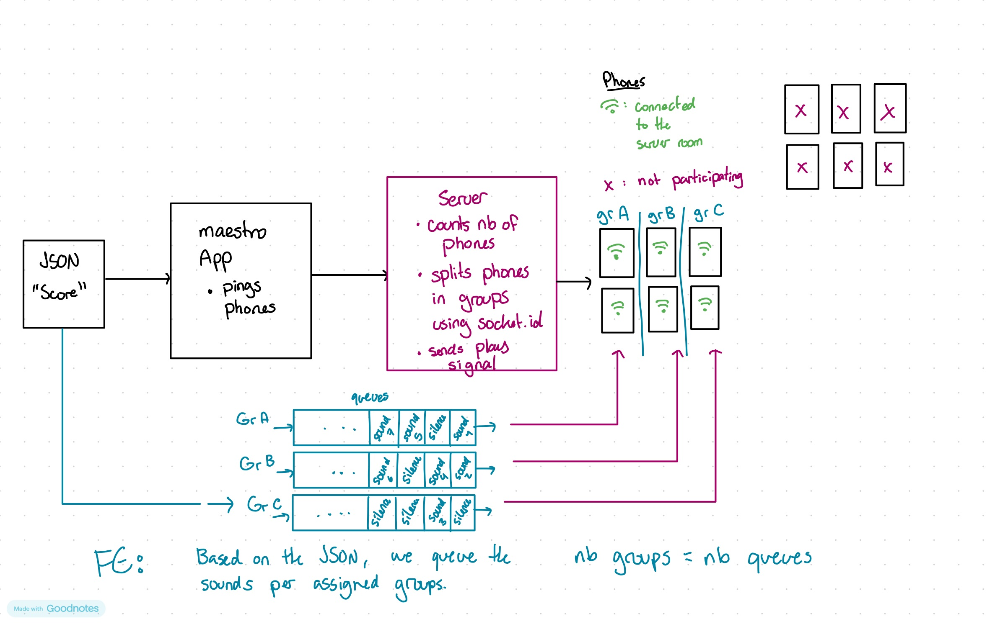

# Week 3 - Proof of Concept and Testing
## Start of Development

### Uncertainties
- How will we receive the audio files (if they will be audio files)
- Are they uploading them directly to our web app? or will they fork + host (general clarity)
- How long will the audio files be (approx)
- Conflict between hosting on compute canada, vs having the flexibility to fork, modify ui, upload files, ect while hosting locally
- Do we need to make different QR codes per room? Just generate links for each room?
- Relationship between number of channels and number of speakers
  
### Meeting with Gabriel
We met with Gabriel on Zoom on Friday, September 25th, to clarify the uncertainties we had regarding the project. After the meeting, it was a lot clearer what the requirements were and how we should proceed structure and exploration wise. 
Our first step is to create a server that we will host temporarily on Render and attempt to communicate the client with the server. We will attempt to play a sound from a file on the client side based on a request from the server. 
Gabriel wants to be able to test this functionality during our next meeting on September 30th. 

### Draft of System Architecture
I drew a sketch of the architecture that we will be implementing for the web application based on the feedback from the meeeting with Gabriel. 
#### How it works

- The students will provide a JSON that contains the information of how their piece should be played.
  - It is the "Score" of the piece
  - The JSON will contain the following information:
    - The number of groups to divide the phones into
    - The audio file names that will be played and in which group they should be played as well as the order
- The maestro interface will tell the server when to start the piece (e.g. on a button click)
  - Maybe a visual indicator of how many clients are connected to the server 
- The server will ping the connected clients to start playing the audio files.
  - The clients will play the audio files based on the information provided in the JSON file.
  - It will look at the queues from each group and play in the order of the queue.

#### For next week, I will...
- setup the server on Render 
- write a small POC to test the communication between the client and the server
- try to have the client play a sound