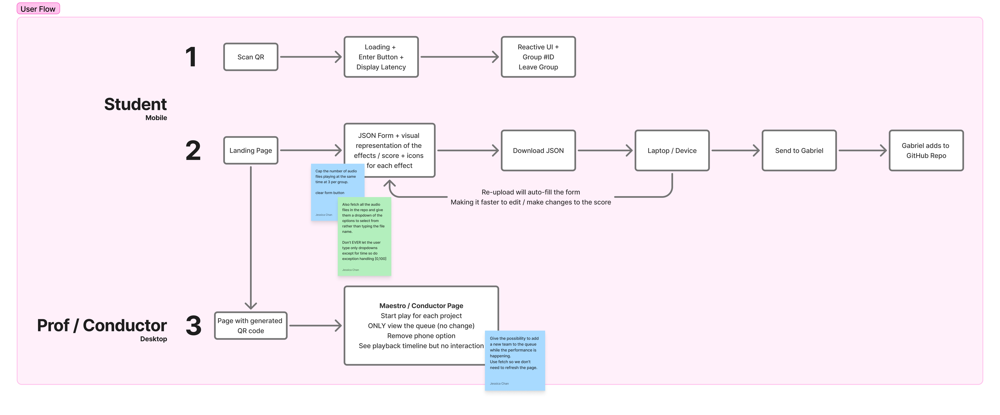

# Week 5 - Working towards a working prototype
## In Development

### Meeting with Gabriel

### User Flow
We decided we needed to create a user flow diagram to visualize the steps a user would take when interacting with the application to help us identify the necessary components and interactions. 
This allowed us to confirm that everyone was on the same page regarding the functionality and flow of the application.

#### Roles
